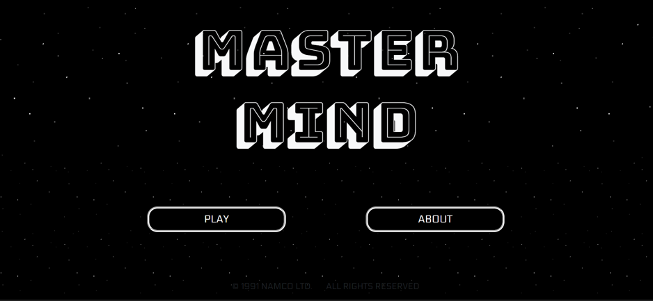
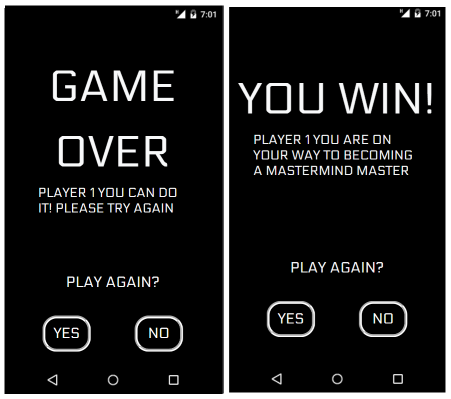

*First in Spanish then in* [*English*](https://https://github.com/ansualo/proyecto3-mastermind#mastermind-game)

---

# Juego Mastermind

### Tabla de contenidos 

- ¿Qué es?
- Desarrollo y tecnologías usadas
- ¿Cómo jugar?
- Errores conocidos 
- Créditos y Licencia

 
*Puedes ver el proyecto* [*aquí.*](https://ansualo.github.io/proyecto3-mastermind/)

     

---

### ¿Qué es? 

El siguiente proyecto se trata de una versión online del juego de mesa Mastermind, creado en un ámbito educativo para GeeksHubs Academy. 

---
### Desarrollo y tecnologías usadas

Las tecnologías usadas en este proyecto han sido Javascript, HTML5, CSS3 y Bootstrap. Este último se ha utilizado para que la web fuese totalmente responsive.

A la hora del desarrollo nos encontramos que el juego, al tener 3 niveles de dificultad, nos hace necesitar diferentes cantidades tanto de colores como de filas

En la página de colores he solucionado este problema haciendo que cada versión, con una cantidad de colores diferentes, se encuentre oculta y solo aparezca en pantalla la correcta según el nivel que cliquemos

La página del tablero la he realizado de forma diferente y, en este caso, el tablero entero se crea a través de Javascript de forma dinámica, añadiendo tantas filas sean necesarias según el nivel.

La página final la he realizado con la misma técnica como la página de colores, ocultando el div que indica si hemos ganado o perdido y solo mostrando el correcto en cada caso.

---
### ¿Cómo jugar?

Mastermind es un juego de ingenio en el que tendremos que adivinar la combinación de 4 colores ganadora. Para empezar a jugar iremos a la página de inicio donde vemos dos botones, el primero será para iniciar una nueva partida y el segundo para conocer las reglas del juego. Los pasos a seguir para jugar son los siguientes: 

Primero introduce tu nombre, aunque si nos saltamos esta parte el juego te llamará Player 1 por defecto.

Elige el nivel de dificultad. En principiante jugaremos con 4 colores y tendremos 10 intentos, en el nivel medio jugaremos con 5 colores y tendremos 8 intentos y por último, en el nivel superior jugaremos con 6 colores durante 6 intentos.

Una vez elegida la dificultad en la siguiente pantalla elegiremos los colores con los que queremos jugar. Clicaremos en los rectángulos morados y gracias a un color picker podremos elegir una gran variedad de colores. Una vez elegidos clicaremos el botón de check para ir a la pantalla del tablero.

En esta pantalla veremos un recordatorio del nivel que hemos elegido y nuestros colores. Clicaremos en estos para empezar nuestra primera combinación y los cuadrados del tablero se irán pintando por orden. Si nos equivocamos podremos borrar los colores clicando en "remove". Una vez decidida la combinación que creamos ser la ganadora clicaremos en "check".

Si hemos acertado tanto el color como la posición donde este se encuentra aparecerá un círculo morado en la posición correcta. Si solo hemos adivinado el color aparecerá un círculo blanco. Si no hemos acertado el color el círculo no cambiará y seguirá siendo negro.

Ganaremos cuando adivinemos la combinación secreta, es decir cuando los cuatro círculos sean morados. Por el contrario, habremos perdido si las filas se terminan.

---
### Errores conocidos

Podría considerarse un fallo conocido la forma en que los círculos del tablero nos indican si hemos acertado. En el caso de que el color se repita puede ser ligeramente confuso, ya que nos puede aparecer la bola blanca y la bola morada a la vez refiriéndose al mismo color.

---
### Créditos y Copyright 

Este proyecto ha sido realizado por mí, Andrea Suárez, en mayo de 2023. Todo el contenido del repositorio se encuentra bajo licencia MIT.

---
---
---

# Mastermind game

### Table of contents 

- What is it?
- How does it work?
- Development and technologies used
- Known bugs 
- Credits and License

 
*You can see the project* [*here.*](https://ansualo.github.io/proyecto3-mastermind/)

     

---

### What is it? 

The following project is an online version of the board game Mastermind, created in an educational environment for GeeksHubs Academy.

---
### Development and technologies used

The technologies used in this project are Javascript, HTML5, CSS3 and Bootstrap. The latter has been used to make the website fully responsive.

At the time of development we found that the game, having 3 levels, makes us need different amounts of colours and rows.

In the colour page I have solved this problem by making that each version, with a different amount of colours, is hidden and only the correct one appears on the screen depending on the level we click on.

I have done the board page in a different way and in this case the whole board is created dynamically through Javascript, adding as many rows as necessary depending on the level.

The final page is created using the same technique as the colour page, hiding the div that indicates whether we have won or lost and only showing the correct one in each case.

---
### How to play?

Mastermind is an strategy game in which we will have to guess the secret 4 colours combination. To start playing we will go to the home page where we will see two buttons, the first one to start a new game and the second one to learn the rules of the game. The steps to play are as follows: 

First enter your name, although if we skip this part the game will call you Player 1 by default.

Choose the difficulty level. In beginner we will play with 4 colours and we will have 10 attempts, in intermediate level we will play with 5 colours during 8 attempts and finally, in advanced level we will play with 6 colours for 6 attempts.

Once you have chosen the difficulty, on the next screen you will choose the colours you want to play with. Click on the purple rectangles and thanks to a colour picker we will be able to choose a wide variety of colours. Once chosen, click on the check button to go to the board screen.

On this screen we will see a reminder of the level we have chosen and our colours. Click on these to start your first combination and the squares on the board will be painted in order. If we make a mistake we can delete the colours by clicking on "remove". Once we have decided on the combination we think will be the winner, click on "check".

If we have guessed both the colour and the position of the colour, a purple circle will appear in the correct position. If we have only guessed the colour a white circle will appear. If we have not guessed the colour correctly, the circle will not change and will remain black.

We will win when we guess the secret combination, i.e. when all four circles are purple. On the other hand, we will have lost if we run out of rows.

---
### Known bugs

The way in which the circles on the board indicate whether we have been successful could be considered a known bug. In the case of a repeating colour it can be slightly confusing, as the white ball and the purple ball can appear at the same time referring to the same colour.

---
### Credits and Licence

This project has been made by me, Andrea Suárez, in May 2023. All the content of the repository is under MIT licence.
